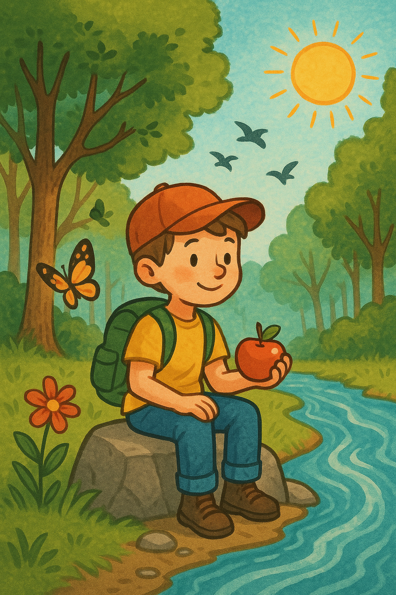

История 1: Лесное утро

(Story 1: A Forest Morning)

Один раз утром мальчик пошёл в лес. Он нёс рюкзак и хотел найти реку. Вокруг были деревья, птицы пели, и светило солнце.

Мальчик увидел цветок и бабочку. Он услышал шум воды и пошёл туда. Он нашёл реку, сел на камень и ел яблоко. Это было хорошее приключение.

New Russian Words (15):

| Russian         | English              |
|-----------------|----------------------|
| мальчик         | boy                  |
| лес             | forest               |
| рюкзак          | backpack             |
| река            | river                |
| деревья         | trees                |
| птицы           | birds                |
| солнце          | sun                  |
| цветок          | flower               |
| бабочка         | butterfly            |
| шум             | noise/sound          |
| камень          | stone                |
| яблоко          | apple                |
| утро            | morning              |
| идти            | to go (infinitive: идти) |
| приключение     | adventure            |

| Russian         | English              |
|-----------------|----------------------|
| Солнце |  Sun |
| Голубое  небо | Blue sky |

